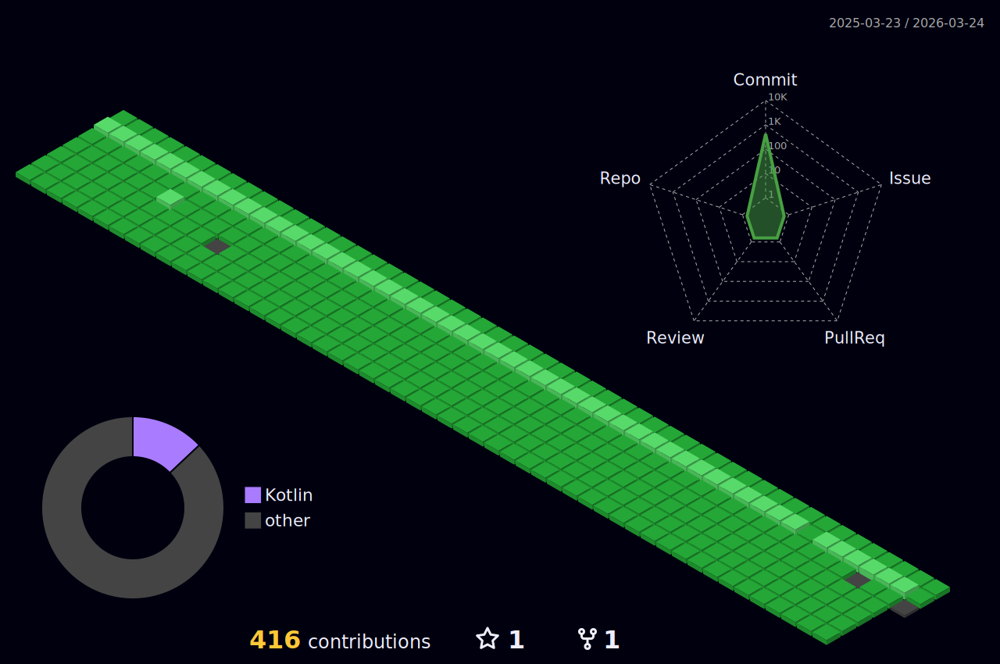

### Hi there 👋

<!--
**soopeach/soopeach** is a ✨ _special_ ✨ repository because its `README.md` (this file) appears on your GitHub profile.

Here are some ideas to get you started:
-->

 

 

---

## 이력

네이버 커넥트재단 <부스트캠프 웹・모바일 7기> 챌린지 수료 / 2022.07.18 ~ 2022.08.12  
네이버 커넥트재단 <부스트캠프 웹・모바일 7기> 멤버십 수료 / 2022.08.29 ~ 2022.12.26

## 배포

[선인장 - 선택이 어려운 인간들을 위한 장소](https://play.google.com/store/apps/details?id=app.saboten.androidApp)

[JMTeng](https://play.google.com/store/apps/details?id=org.gdsc.jmt&hl=ko-KR)

[Smalt](https://play.google.com/store/apps/details?id=com.soopeach.smalt&hl=en)
